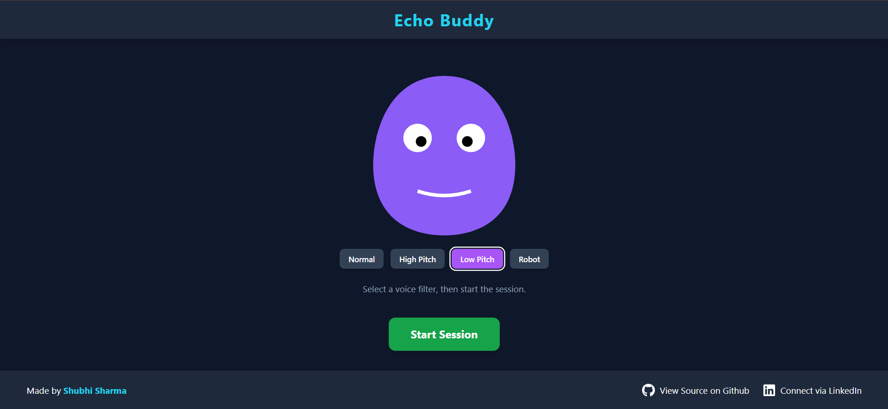

# Echo Buddy 🎙️🤖


**Echo Buddy** is the first project for the **#30DaysOfVibeCoding** challenge! It's an interactive web application featuring a cute animated character that listens to your microphone and repeats what you say with fun voice effects and synchronized lip movements.

---

### **[View Live Demo 🚀](https://echo-buddy-shubhi.vercel.app/)**




---

## 📜 Description

As the inaugural project of the **#30DaysOfVibeCoding** challenge, Echo Buddy serves as a "Talking Tom" clone built entirely with modern web technologies. The goal was to explore the browser's powerful audio APIs in a fun and visual way. The application captures audio from a user's microphone, processes it with different voice filters, and plays it back, all while animating a character on screen in real-time.

This project is a perfect example of "Vibe Coding"—using AI as a creative collaborator to quickly move from idea to a polished, deployed application.

## ✨ Features

-   **Real-time Audio Recording:** Captures audio using the `MediaRecorder` API.
-   **Automatic Silence Detection:** Intelligently detects when the user stops speaking to end the recording.
-   **Continuous Loop Mode:** Once a session is started, it continuously listens and repeats, creating an interactive loop.
-   **Voice Filters:** Apply fun audio effects powered by **Tone.js**:
    -   Normal
    -   High Pitch (Chipmunk)
    -   Low Pitch (Deep Voice)
    -   Robot (BitCrusher effect)
-   **Dynamic Character:** The character's color changes based on the selected filter.
-   **Live Lip-Sync:** The character's mouth animates in real-time based on the volume of the playback audio.
-   **Responsive Design:** A clean, mobile-first interface built with Tailwind CSS.


## 🛠️ Tech Stack

-   **Framework:** [React](https://reactjs.org/) (via [Vite](https://vitejs.dev/))
-   **Audio Processing:** [Tone.js](https://tonejs.github.io/) & Web Audio API (`MediaRecorder`, `AudioContext`)
-   **Styling:** [Tailwind CSS](https://tailwindcss.com/)
-   **Icons:** [React Icons](https://react-icons.github.io/react-icons/)
-   **Deployment:** [Vercel](https://vercel.com/)

## 🚀 Getting Started

To run this project locally, follow these steps:

1.  **Clone the repository:**
    ```bash
    git clone https://github.com/shvbhii/echo-buddy.git
    ```
    *(Replace `your-username/echo-buddy.git` with your actual repository URL)*

2.  **Navigate to the project directory:**
    ```bash
    cd echo-buddy
    ```

3.  **Install the dependencies:**
    ```bash
    npm install
    ```

4.  **Start the development server:**
    ```bash
    npm run dev
    ```
    The application will be available at `http://localhost:5173`.

## 🤝 How to Contribute

Contributions, issues, and feature requests are welcome! Feel free to check the [issues page](https://github.com/your-username/echo-buddy/issues).

1.  **Fork the Project**
2.  **Create your Feature Branch** (`git checkout -b feature/AmazingFeature`)
3.  **Commit your Changes** (`git commit -m 'Add some AmazingFeature'`)
4.  **Push to the Branch** (`git push origin feature/AmazingFeature`)
5.  **Open a Pull Request**

## 👤 Creator

Crafted with ❤️ by **Shubhi Sharma**.

[](https://www.linkedin.com/in/shvbhi)

## 📄 License

This project is open-source and licensed under the MIT License. See the `LICENSE` file for more details.